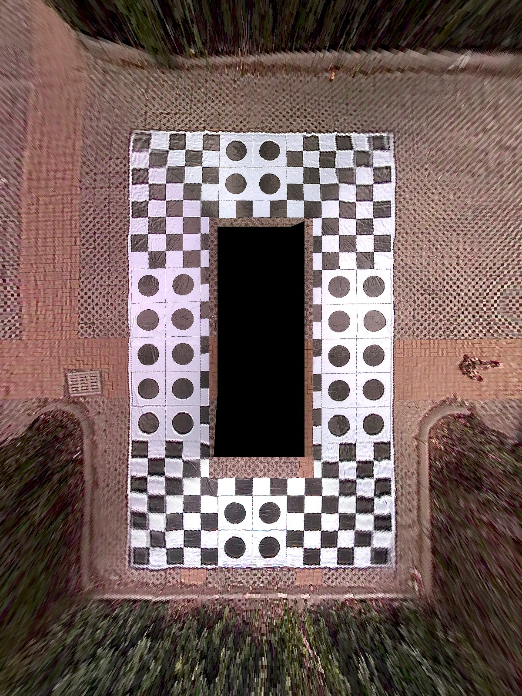

# 10000 fps 🚀 for 360 Surround-View CUDA Solution
The project refers to AdasSourrondView[3], modified to a cuda-accelerated version.

## Reference Repo

|index|repo|info|
|----|----|----|
|1|[surround-view-system-introduction](https://github.com/neozhaoliang/surround-view-system-introduction)|python verison, refrence repo for 2D avm|
|2|[3d surround-view-system](https://github.com/SokratG/Surround-View)|cuda+opengl verison, for 3d avm|
|3|[AdasSourrondView](https://github.com/JokerEyeAdas/AdasSourrondView)|c++ verison|

## Build And Run
```
run surround_view.ipynb or nvcc cuda.cu -o cuda -lopencv_core -lopencv_imgcodecs && ./cuda
```
## Result
The code inputs are 4 fisheye camera images, and the stitched image results are as follows. The project utilizes cuda to accelerate the c++ code with a frame rate over 10k.


